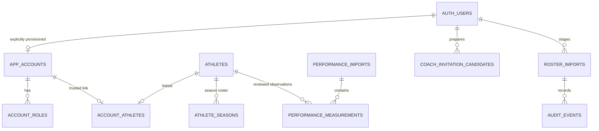

# PACU data model

## Identities and ownership

An athlete is a baseball identity, not a login account. Its internal UUID and permanent, unique `athlete_code` survive name, jersey, season, and contact changes. The application never matches identities by name or jersey. It never links an account from CSV email or editable Auth email/user metadata.

| Table | Purpose | Key / important constraints |
| --- | --- | --- |
| `auth.users` | Supabase-managed authentication credentials and sessions | Auth UUID; managed separately by the owner |
| `app_accounts` | Trusted application enable/disable status | Auth UUID FK; inactive by default |
| `account_roles` | Multiple roles per account | `(user_id, role)`; `admin`, `coach`, `player` |
| `account_athletes` | Administrator-approved identity link | One athlete per account and one account per athlete; linked actor/time |
| `athletes` | Permanent identity plus name, contact, photo URL | Generated UUID; unique immutable-in-app athlete code; unique lowercase nonblank email |
| `athlete_seasons` | Roster information for a season | `(athlete_id, season)`; jersey `0` valid; optional values NULL |
| `roster_imports` | Staged source rows, authoritative preview and application status | Draft UUID, season, source SHA-256, actor, timestamps |
| `performance_measurements` | Immutable reviewed numerical observations | Athlete UUID; unique observation ID and file/sheet/row/column position; canonical metric/unit; value/date and provenance |
| `performance_imports` | Shared numerical import receipts | Actor/time and created/unchanged counts; no original report contents |
| `coach_invitation_candidates` | Reviewed coach preparation contacts | Unique normalized email; bounded name; creator/time; no Auth or role link |
| `audit_events` | Append-only application audit | Actor, event, target/import UUID, before/after or summary, timestamp |

Application users cannot directly write or delete these tables. PostgreSQL owner access remains privileged and must be used deliberately. No views bypass RLS. Foreign keys prevent silently deleting accounts/athletes with history. No automatic Auth trigger provisions application accounts.



## Authorization

All public application tables have RLS enabled, anonymous grants revoked, and no direct write grants/policies for authenticated users. Read policies require **current trusted active status**. Private functions avoid recursive RLS lookups, pin `search_path=''`, fully qualify tables, and have default PUBLIC execution revoked. Only the necessary helpers can execute for authenticated users. The `private` schema is not exposed by the Data API.

| Identity | Athlete/season/measurement reads | Import preview/history/audit | Account administration |
| --- | --- | --- | --- |
| Anonymous | Denied | Denied | Denied |
| Unconfigured, role-free or disabled account | No athlete rows | Denied | Denied |
| Player, no trusted athlete link | No athlete rows | Denied | Denied |
| Active Player | Only linked athlete, seasons and measurements | Denied | Denied |
| Active Coach | Entire roster and profiles | Reviewed performance imports and own receipts; roster drafts/audit denied | Denied |
| Active Admin | Entire roster and profiles | Allowed; only uploader approves its draft | Allowed for other accounts, with explicit approval/audit |
| Active Admin + Player | Union of roles: administrative access plus own link | Admin access | Admin access |

The owner-authorized team leaderboard is a separate read-only projection available to active Players, Coaches and Admins, including unlinked active Player accounts. It returns only eligible current-roster names/PAC/jersey/position and the selected latest canonical value/date/source, with peer profile links restricted by the actor and effective preview. It does not expose emails, full histories, report identifiers or files, and does not alter the table read policies above.

An account's roles and status are queried live, not copied into editable metadata or trusted solely from a JWT. A disabled account loses database access on subsequent statements even when it still has a valid access token. Data already displayed or a request already completed cannot be recalled. All server pages/actions/API routes also verify authenticated identity and live access. Protected responses are private/no-store; no shared data cache is used.

Normal app reads and RPC calls use the public publishable key and the signed-in user's session. The narrow administrative RPCs are SECURITY INVOKER wrappers around private definer functions that explicitly check current active status and the allowed roles for each operation. These database operations require no privileged app key and intentionally perform only the allowed audited writes. Optional Auth user invitations use a separate server-only secret for Auth directory lookup and email invitations, never for application table access.

Account mutations and approvals acquire the account advisory lock first, then the roster lock if needed, and authorize after waiting. No administrator may modify its own account through the app. This avoids self-lockout and ensures another active administrator remains when one is disabled/demoted. Owner scripts use explicitly chosen Auth UUIDs and audit their changes.

## Invited account provisioning

The third migration, `202609050003_invited_account_provisioning.sql`, adds `public.admin_provision_invited_account(target_user uuid, account_role text, linked_athlete uuid)`, returning `void`. It creates no tables, Auth users or emails. Its private definer function pins an empty search path, shares advisory lock `72104001` with the existing account writer, and performs all checks after acquiring the lock:

- The caller must currently be an active administrator. Coach, Player, unconfigured, role-free and disabled callers are denied.
- The target must have no `app_accounts` row. Existing active, disabled and role-free accounts are all preserved; invitation provisioning cannot replace their roles or links.
- The role must be exactly `coach` or `player`. Player requires an explicit existing athlete link; Coach requires a null link. The invitation path cannot create an administrator or combine roles.
- The existing `private.configure_account` function validates Auth user existence, athlete existence/unique ownership and self-modification, then atomically saves active status, the single role, optional link and one `account_configured` audit event.

The new RPC rejects existing accounts with SQLSTATE `23505`, invalid role/link/null-target inputs with `22023`, and unauthorized callers with `42501`. Other existing configuration constraints retain their existing errors. A failure anywhere in the database operation rolls back all account/role/link/audit writes. Default PUBLIC and anonymous execution are revoked; only authenticated callers can reach the checked wrapper. This does not grant direct table writes or expose the private schema.

`lib/supabase/auth-admin.ts` is a separate server-only module. With both `PACU_INVITATIONS_ENABLED=true` and `SUPABASE_AUTH_ADMIN_SECRET` configured, it exposes only Supabase's Auth administrator interface. The invitation action uses `listUsers` to reject existing email accounts and `inviteUserByEmail` for one reviewed recipient. The directory stays on the server. The actual returned Auth UUID and explicitly selected athlete are then passed to the provisioning RPC using the freshly checked administrator's **ordinary session**. No roster email, user metadata or recipient-supplied athlete claim creates authorization.

Email delivery and database provisioning are separate operations, not one transaction. A rejected or incomplete directory scan sends nothing. An uncertain provider result is reported without an automatic retry. If an invitation is sent but provisioning is unconfirmed, the administrator must inspect the Auth user and review existing access; the application does not automatically resend, delete users or overwrite an existing account. The shared database lock protects the final absence and link checks when another administrator acts during delivery.

Invitation acceptance is a separate public authentication flow: a GET only displays a confirmation; explicit POST verifies the token as `invite` or `recovery`, then opens a fixed password destination. It does not grant application roles. Private display-preview restrictions remain enforced in the app before invitation sends; the database continues to authorize the real actor. Browser-local data is not uploaded, shared or migrated by creating accounts. Sending stays disabled until the migration, SMTP, templates and recipient flow have been verified. See [INVITATIONS](INVITATIONS.md).

## Master roster CSV contract

Encoding: UTF-8, comma-delimited, with the following **exact 16 headers in this order**. Quoted commas and escaped quotes are supported. Keep one athlete per physical line; interior blank lines and multiline cells are rejected so displayed CSV row numbers are reliable. A trailing newline and UTF-8 BOM are accepted.

```csv
athlete_code,first_name,preferred_name,last_name,pacific_email,jersey_number,primary_position,secondary_position,player_type,bats,throws,academic_class,eligibility_year,graduation_year,roster_status,profile_photo_url
```

| Field | Location | Accepted value |
| --- | --- | --- |
| `athlete_code` | Identity | Required; 3–40 uppercase letters/digits/underscore/hyphen, starting with a letter/digit; trimmed and uppercased by CSV parser |
| `first_name`, `last_name` | Identity | Required on every row; 1–80 characters |
| `preferred_name` | Identity | Optional; up to 80 characters |
| `pacific_email` | Identity | Optional; lowercase normalized valid email, up to 254 characters; globally unique among athletes |
| `jersey_number` | Season | Optional integer `0`–`99`; never used for identity matching |
| `primary_position`, `secondary_position` | Season | Optional: `P`, `C`, `1B`, `2B`, `3B`, `SS`, `LF`, `CF`, `RF`, `OF`, `IF`, `DH`, `UT` |
| `player_type` | Season | Optional: `pitcher`, `position`, `two_way` |
| `bats`, `throws` | Season | Optional: `L`, `R`, `S` (switch/both) |
| `academic_class` | Season | Optional: `freshman`, `sophomore`, `junior`, `senior`, `graduate` |
| `eligibility_year` | Season | Optional integer `1`–`6`; a roster label, not an eligibility determination |
| `graduation_year` | Season | Optional integer `2000`–`2100` |
| `roster_status` | Season | Optional: `active`, `inactive`, `redshirt`, `alumni` |
| `profile_photo_url` | Identity | Optional HTTPS URL on a DNS hostname; up to 2,048 characters; no credentials/port/control characters. Stored for later display; this phase uses initials and does not fetch it. |

All fields reject control characters; other categorical tokens are case-sensitive as listed. These are this project's explicit roster conventions, not inferred vendor fields. Missing optional data stays NULL/blank; the UI represents empty roster cells with an em dash. No measurements, body composition, velocity, force-plate, sprint, or performance values belong in these tables.

The selected season is outside the CSV, entered by the administrator as `YYYY` or `YYYY-YY`. Jersey/position/class/status and bats/throws are snapshots for that season. Identity/name/contact changes apply to the same permanent athlete across seasons, and the preview shows those changes.

## Import lifecycle and guarantees

1. **Upload:** only an active Admin can submit. Server Action verifies Auth and trusted role, extension, nonempty UTF-8 file, 1 MiB raw limit, header order, exactly 16 cells, and 1–500 rows. The source-byte SHA-256 is provenance only; it is not a permanent uniqueness rule.
2. **Stage:** SQL independently validates the JSON shape, exact allowed keys, text cells, value ranges, and conflicts. It caps expanded JSON at 3 MiB to allow CSV-to-JSON expansion. Invalid records get `reject` and explanations. Duplicate normalized codes flag all duplicates; duplicate nonblank incoming emails and emails already owned by a different code are rejected. Simultaneous email swaps must be resolved explicitly; the importer does not infer them.
3. **Preview:** persisted by the database with uploader, season, source rows, before/after values, and `create`, `update`, `unchanged`, `reject` counts. A new season on an existing athlete is an update. Preview is displayed from this trusted draft, never from client-provided status/diffs.
4. **Approve:** the server accepts only draft UUID plus a confirmation. SQL locks and verifies active admin/uploader, draft state and 24-hour expiry, then recomputes the full preview. If anything relevant changed, the batch is rejected as stale. Every rejected row blocks the entire batch.
5. **Apply:** one database RPC/transaction upserts by permanent code and athlete+season, logs row changes and batch summary, and marks the draft applied. Any row or audit failure rolls everything back. Re-approving an applied draft returns its prior summary without writing again. Re-importing an unchanged CSV produces unchanged rows.

Blank optional input never overwrites an existing populated value; explicit clearing is not part of this CSV workflow. Omitted athletes are never deleted or deactivated. Uploading a new code creates a new identity, so administrators must preserve assigned codes. Unchanged rows are not rewritten. No import creates Auth users, roles, account links, or invitations, including when the CSV email changes.

Audit records contain sensitive roster details once real data is introduced. Only active administrators can read them, and application users cannot edit/delete them. Retention/purge procedures are owner operations to define before collecting real data; this phase implements no automatic purge or raw-file storage.


## Shared performance observations

`202609060001_performance_profiles.sql` adds `performance_measurements`, `performance_imports`, and private canonical metric/unit catalogs. Catalog tables have no direct application read/write grants. Measurement read policies use live `private.can_read_athlete`: staff read all, Players only their linked athlete, inactive/unconfigured/anonymous identities read none. Admins read all import receipts; Coaches read only their own receipts. Audit remains Admin-only. Application users have no direct write/delete grants.

`admin_import_performance(p_rows jsonb)` calls a private definer function that pins `search_path`, acquires account lock `72104001`, then rechecks active Admin or Coach status. The 1–500-row/1-MiB JSON input accepts only observation ID, permanent athlete code, metric key, date, value, unit and source file/sheet/row/hash fields. The observation ID encodes hash/sheet/row/column and must match its supplied provenance. Canonical metric/unit foreign keys and mathematical value bounds supplement repeated RPC validation.

A new observation is tied to the existing athlete UUID; no identity or Auth account is created. Duplicate input IDs/source positions and ambiguous same-report RENPHO metric/unit rows reject the transaction. Existing observations are immutable: semantic conflicts abort all rows, receipt and audit; equal observations remain unchanged. Renamed-file retries preserve original source metadata. Each accepted call has an import receipt and count-only audit, including unchanged-only retries; observation idempotence does not mean suppressing those receipts. No image, OCR text, report ID or full backup is stored.

The private sharing UI parses a workspace backup locally and forwards a new object with exactly the eleven Measurement fields. It never forwards arbitrary properties from the backup. Unsupported metric labels are listed as exclusions; invalid recognized metrics or source evidence block approval. Both server action and adapter recheck access and input. The posted Measurement JSON and normalized RPC JSON each have a 1-MiB bound. See [PLAYER_PROFILES](PLAYER_PROFILES.md) for fields, units and workflow limits.

`athlete_performance_summary(p_athlete_id uuid)` accepts only an exact authorized athlete. Its private definer reads peer observations solely to return fixed-metric, fixed-period aggregates for that athlete. The cohort is season `2026-27`, status null/active/redshirt, with one latest reading for each exact metric/unit/normalized source/period. Percentiles require at least five comparable athletes, include tied midranks, and invert lower-direction timings/rates. Body/spin ranks are neutral numerical positions. No caller-provided thresholds, periods or cohort lists can probe peer data; players cannot retrieve raw peer measurements. Fall 2026 and body-only Summer 2026 remain separate.

`athlete_performance_measurements(p_athlete_id uuid, p_offset integer default 0)` reads one exact authorized athlete through a `SECURITY INVOKER` function, retaining the caller's table permissions and RLS. It returns only the 14 measurement/provenance fields consumed by the server adapter, excluding `imported_by` and other audit details. Pages contain at most 1,000 observations ordered by import timestamp then database ID; offsets must be multiples of 1,000 from 0 through 20,000. Both this RPC and the comparison summary pin `extra_float_digits=3` while forming JSON, then restore the caller's setting, so raw and derived values retain exact floating-point identity.

`202609060006_staff_performance_imports.sql` expands only the reviewed performance writer to active Admins and Coaches. Both the legacy-code wrapper and immutable core authorize after lock `72104001`; private original-code execution remains unavailable to application roles. `performance_report_measurements(p_file_hash text)` is a staff-only `SECURITY INVOKER` read using exact lowercase SHA-256, existing table grants/RLS, an exact 11-field Measurement projection and a 501-row sentinel cap. It pins JSON precision to preserve repeat-report deduplication; the app rejects more than 500 rows rather than accepting a partial report. `/imports` requires explicit review and sends only whitelisted numerical rows; `requireImportAccess` repeats the live check immediately before the write RPC.

`202609060008_renpho_report_positions.sql` also enforces a unique `(file_hash, source_sheet, source_column)` for exact `RENPHO` source rows whose sheet is a canonical `RENPHO report · Page N`. OCR engines may assign different source rows to the same field; this index rejects a second field observation atomically even when two staff reviews loaded an empty report before either save. A collision rolls back the whole import and its receipt/audit. Refreshing the report can reconcile equal values using the original provenance. Generic trial tables retain row-based identity.

`lib/performance-server.ts` checks the presented athlete before every protected page/summary load, because Admin View as retains the real Admin JWT. It validates page shape, field whitelist, athlete ownership, numerical types, duplicate observations and the 20,000-observation profile limit. It reconstructs source batch metadata from permitted observations without granting players import-receipt access. Pure metric projections share deterministic millisecond-precision import-time ties with SQL. Derived muscle percentage requires one same-report weight/muscle pair across all units, matching lb/kg units and canonical report provenance; it is not persisted as an invented raw measurement.

## Coach account preparation

`202609060002_coach_rollout.sql` adds `coach_invitation_candidates` and `admin_prepare_coach(p_display_name,p_email,p_reviewed)`. Only active administrators can read preparation contacts or save them through the audited RPC. After lock `72104001`, it requires explicit review, trims names, normalizes email case/spacing, and upserts the name by unique email. New entries are capped at 100; identical retries preserve the existing record.

Preparation creates no Auth identity, account role, athlete link or invitation. `/admin/rollout` combines the current roster with already-authorized account links to show preparation status. A roster email is a contact field, not evidence of inbox ownership; connected access is not proof of completed password setup. Sending remains a separately approved operation described in [INVITATIONS](INVITATIONS.md).

## Additional source adapters — roadmap

Future sources will use the master roster as the identity registry:

- Additional RENPHO formats beyond the supported local portrait reader and approved numerical sharing workflow
- Blast exports
- Rapsodo hitting and pitching exports
- Full Swing exports
- Game statistics maintained in Google Sheets
- Physical/sprint testing maintained in Google Sheets
- Force-plate exports when equipment is available

Before implementation, obtain actual source files, export versions, field definitions, units, time conventions, ownership/access requirements, and representative edge cases. Do not invent parser schemas or connect services based on product names.

The intended future flow is **source receipt → versioned source-specific adapter → validation → explicit identity resolution → human preview/approval → transactional domain records with provenance → authorized reporting**. Unknown or ambiguous athlete references are queued for administrator resolution, never fuzzy-linked from name/email/jersey. Future import jobs should record source fingerprint, adapter version, units/time provenance, errors, approval, and idempotency rules. Measurements belong in separate time-stamped domain tables tied to athlete UUIDs, not in roster identity or seasonal membership.

The implemented shared numerical import and fixed profile calculations are described below. Reviewed Fall game snapshots now have a separate source-specific workflow in [GAME_STATS](GAME_STATS.md); daily Codex checks need a valid staff session to save. Additional unverified vendor schemas, force plates, AI interpretation and training recommendations remain deferred.

Migration007 stores immutable reviewed source versions in `game_stat_snapshots`, the current version per source in `game_sync_state`, and athlete-scoped current numeric rows in `game_stats`. Only active staff can import/read source snapshots; players read only their linked game rows. Source rows retain count/rate evidence, actual event dates when known, hashes and fetch timestamps. A bounded, locked import replaces one complete newer source atomically; missing previously saved entries, source conflicts and stale/future timestamps retain the last good data. QPA remains cumulative Fall totals. Pitching rows require explicit event/block dates. These tables do not append daily copies to physical/test measurements or create account links.

## Browser-local import workspace (September 4 scope expansion)

`lib/local-workspace.ts` defines a versioned IndexedDB record containing roster, measurements, batch history, mode, and a revision number. It is separate from every Supabase table and requires no migration. Roster identities use permanent local athlete codes; measurement records preserve date-only ISO dates, explicit metric/unit/value/source, source file/sheet/row/hash, and batch ownership. Writes compare the saved revision within the same transaction. Restores validate the complete graph before saving. No browser import creates an Auth account or trusted database role. See [IMPORTS.md](IMPORTS.md).

### RENPHO reports and local identifiers

Local roster records may carry an optional canonical `renpho_id` and `renpho_ids` containing manually confirmed report IDs. Both use trimmed uppercase exact identifiers, 1–80 letters/digits/underscores/hyphens. Identifiers must be unique across the roster; ambiguous ownership blocks import/restore. These are external device/report identifiers, not permanent athlete codes or Auth UUIDs. A new or unknown report ID requires explicit player selection. The app never derives identity from name, identifier prefixes or date fragments.

The local roster template extends the 16 snake_case roster fields with optional `renpho_id`; the protected CSV/SQL contract above remains exactly 16 fields. Roster imports never clear a saved identifier merely because an incoming cell is blank. A remembered report ID is stored with its explicitly selected athlete during the same revision-checked IndexedDB transaction as the approved measurement batch. Invalid IDs, conflicting ownership, measurement errors or stale revisions prevent that combined save.

The portrait RENPHO adapter consumes disjoint OCR regions. It reads seven composition measurements using the isolated `Measurement(lb)`/`Measurement(kg)` header, two assessment values and seven Other Indicators. It ignores optimal ranges, classification text, scores, targets and segmental charts. Title, explicit report ID, explicit English-month Test Date and seven exact composition labels gate recognized-layout unit conventions. Only in that recognized layout, SMI's exact numeric reading plus `kg/m` can produce a proposed `kg/m²` candidate with immutable `unitNeedsConfirmation`; the preview requires its canonical key in explicit `confirmedUnits` or the reading must be excluded. An isolated Fat-Free Mass `Ib`/whitespace-separated `1b` suffix can be corrected to `lb`, tagged `ocr-unit-correction` and retained verbatim in source evidence. Neither path changes numeric digits, and the generic text parser remains strict. Calendar validation supports full English month names and their three-letter abbreviations; time is validated then omitted from the stored date-only value. Report IDs never supply dates.

Candidate metadata includes canonical metric key/fixed column, page/source line, unit evidence and extracted source text for temporary review. Only approved normalized `Measurement` objects are persisted. They use source `RENPHO`, sheet `RENPHO report · Page N`, original source line and fixed metric column in the existing hash/sheet/row/column observation identity. Deselecting/reordering metrics does not renumber observations. A RENPHO-only reconciliation check also compares exact file hash/page/fixed column when OCR line grouping changes: identical semantics are unchanged, conflicts are rejected, and saved provenance is never rewritten. Changed athlete/date/unit/value semantics for an existing observation require removing its earlier batch. A different file hash can still represent the same real-world test and needs review.

Images, PDF contents, OCR text and unconfirmed ID evidence remain in memory, without server uploads or backup serialization. Backups do include approved readings, source filenames and explicitly saved IDs. Parsing is not a health interpretation, and recognized layout does not certify OCR accuracy. Every import requires visual review and confirmation.

### RENPHO chart projections

Charts are read-only projections of approved measurements supplied by the browser workspace or the authorized shared-data adapter. The chart component adds no persisted fields; shared persistence uses its separate migration. Grouping requires the selected athlete code, source `RENPHO`, reviewed-report page provenance, file hash and test date. Distinct files on one date stay distinct, and missing values never backfill from a different report. Only unambiguous supported metric/unit pairs with finite, nonnegative values are charted; percentages also require 0–100. Excluded rows remain in the original history and backup. Units are never converted, and overlapping mass/percentage measurements are never summed. See [RENPHO_CHARTS.md](RENPHO_CHARTS.md) for chart and scale definitions.

### Access views (September 5 scope expansion)

No new tables or role grants are added. Protected display previews require an existing active administrator on each request. The actor-bound, HTTP-only, same-site session cookie selects Coach or an explicitly verified athlete for Player and carries a server-checked four-hour expiry. It can only reduce the displayed access. The real Auth identity and database roles stay unchanged; RLS continues to constrain that identity. Because admin RLS is broader than a player preview, every profile/API entry and overview query additionally applies the effective athlete restriction before returning data. Shared-measurement and game-snapshot mutations require current trusted Admin/Coach access; active Admin Coach views may use the exact Coach import scope, while Player views cannot mutate. Coach-view receipt queries explicitly filter to the actual user to preserve normal Coach receipt visibility even under an Admin JWT. Roster, account and coach-preparation mutations remain Admin-only.

The separate browser-local `sessionStorage` preference stores only role and optional local athlete code; it is not part of the IndexedDB workspace or JSON backup and is not authorization. Its player data projection includes only the selected athlete and readings. The owner's preview menu can still choose another player. Admin Coach view enables local performance imports; Player view blocks them. Both views hide and block roster, backup, reset and account controls. An actual Coach has performance import controls, but cannot change roster identities, switch views, export backups, restore or reset the workspace. The browser authorization check binds the actual staff role as well as user and path, so stale Admin presentation does not survive a downgrade to Coach. Existing measurements and permanent codes are never rewritten by switching views.


## PAC Athlete IDs

The owner requested LOCAL-NNNN → PAC-NNNN with the same numeric suffix. Migration `202609060005_pac_athlete_codes.sql` installs a bounded, reviewed Admin RPC and a private legacy-alias table. Applying an explicit UUID/old/new mapping updates only the athlete code, update time and audit event. Account links, seasonal rows and observations keep the same UUID foreign keys. Previous IDs cannot be reassigned. Alias-aware roster and measurement wrappers preserve existing validation, freshness, immutable observation checks and atomic writes.

Browser workspaces migrate roster identities, local season links and measurement athlete codes atomically while retaining observation IDs and legacy aliases. New generated IDs advance from the existing master roster. Independent offline workspaces do not coordinate allocation; shared collisions reject for review. Old JSON backups normalize before shared-import matching. See [ATHLETE_IDS](ATHLETE_IDS.md) for compatibility and testing.

## Extended profile testing catalog

Migration 010 adds grip strength, max/average bat speed, smash factor, max distance, infield/outfield velocity and average pitch velocity. Their labels and exact units are shared by the importer, saved database observations, player cards and leaderboards. Generic bat speed stays distinct, raw events are not aggregated, and no existing observation is rewritten. Migration 011 adds the explicitly authorized narrow leaderboard reader without changing ordinary table RLS or import permissions.

The coach presentation update changes no tables, IDs, observations or grants. Feet/inches height formatting is display-only; automatic leaderboard selection still requests one exact metric/source/unit/period partition per stat card. See [LEADERBOARDS](LEADERBOARDS.md) for deterministic display selection.


## Profile Overview insights

The profile Overview and workspace landing change require no schema, grant, ID or observation changes. Insights derive only from the existing authorized player metric cards. Strengths and weaknesses use favorable team percentiles with at least five matching measured players; improvements compare the latest reading with the most recent earlier distinct test date for the same athlete, metric, source, unit and period. Neutral body measurements and spin are excluded from performance judgments. Pitcher-only profiles omit hitting and speed/agility cards from tabs and insights; speed/agility is also excluded from displayed measurement history. Saved readings remain unchanged. Body Fat % moves into Body Composition without changing its canonical group or comparison rules. Game-stat data stays behind its existing separate protected page; profile loads no longer query it. See [PLAYER_PROFILES](PLAYER_PROFILES.md) for thresholds and comparison rules.

## Manual testing and checklist projection

Manual results reuse `performance_measurements` and the existing audited staff import RPC. A random submission UUID produces a SHA-256 provenance hash and fixed observation IDs; the reviewed athlete/date/protocol/metric/value/unit payload remains identical across an explicit uncertain-save retry. Dates and role eligibility are revalidated against the current authorized roster on the server. The checklist is derived from valid Fall readings for current eligible players, not a mutable completion flag. Its minimal staff-only projection excludes emails/account fields and fails on incomplete query pages. No schema, grant, auth identity or production data migration is introduced. See [TESTING_WORKFLOW](TESTING_WORKFLOW.md).
