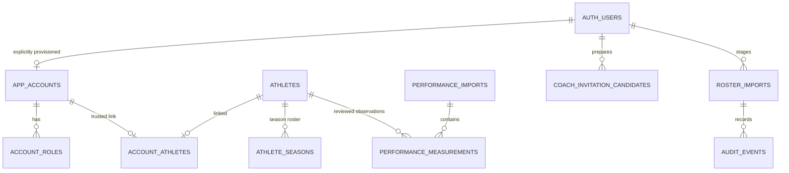

# PACU data model

## Identities and ownership

An athlete is a baseball identity, not a login account. Its internal UUID and permanent, unique `athlete_code` survive name, jersey, season, and contact changes. The application never matches identities by name or jersey. It never links an account from CSV email or editable Auth email/user metadata.

| Table | Purpose | Key / important constraints |
| --- | --- | --- |
| `auth.users` | Supabase-managed authentication credentials and sessions | Auth UUID; managed separately by the owner |
| `app_accounts` | Trusted application enable/disable status | Auth UUID FK; inactive by default |
| `account_roles` | Multiple roles per account | `(user_id, role)`; `admin`, `coach`, `player` |
| `account_athletes` | Administrator-approved identity link | One athlete per account and one account per athlete; linked actor/time |
| `athletes` | Permanent identity plus name, contact, photo URL | Generated UUID; unique immutable-in-app athlete code; unique lowercase nonblank email |
| `athlete_seasons` | Roster information for a season | `(athlete_id, season)`; jersey `0` valid; optional values NULL |
| `roster_imports` | Staged source rows, authoritative preview and application status | Draft UUID, season, source SHA-256, actor, timestamps |
| `performance_measurements` | Reviewed numerical observations; narrow audited ownership correction only | Athlete UUID; unique observation ID and file/sheet/row/column position; immutable canonical value/date and provenance |
| `performance_imports` | Shared numerical import receipts | Actor/time and created/unchanged counts; no original report contents |
| `private.renpho_identity_aliases` | Exact normalized report-ID ownership | ID to athlete UUID; additive ordinary sync, selected-alias correction only through the reviewed Admin workflow |
| `private.renpho_report_corrections` | Idempotent administrative report correction receipts | Request UUID, actor/time, exact reviewed assignments, state fingerprint and counts; no direct application table access |
| `coach_invitation_candidates` | Reviewed coach preparation contacts | Unique normalized email; bounded name; creator/time; no Auth or role link |
| `audit_events` | Append-only application audit | Actor, event, target/import UUID, before/after or summary, timestamp |

Application users cannot directly write or delete these tables. PostgreSQL owner access remains privileged and must be used deliberately. No views bypass RLS. Foreign keys prevent silently deleting accounts/athletes with history. No automatic Auth trigger provisions application accounts.



## Authorization

All public application tables have RLS enabled, anonymous grants revoked, and no direct write grants/policies for authenticated users. Read policies require **current trusted active status**. Private functions avoid recursive RLS lookups, pin `search_path=''`, fully qualify tables, and have default PUBLIC execution revoked. Only the necessary helpers can execute for authenticated users. The `private` schema is not exposed by the Data API.

| Identity | Athlete/season/measurement reads | Import preview/history/audit | Account administration |
| --- | --- | --- | --- |
| Anonymous | Denied | Denied | Denied |
| Unconfigured, role-free or disabled account | No athlete rows | Denied | Denied |
| Player, no trusted athlete link | No athlete rows | Denied | Denied |
| Active Player | Only linked athlete, seasons and measurements | Denied | Denied |
| Active Coach | Entire roster and profiles | Reviewed performance imports and own receipts; roster drafts/audit denied | Denied |
| Active Admin | Entire roster and profiles | Allowed; only uploader approves its draft | Allowed for other accounts, with explicit approval/audit |
| Active Admin + Player | Union of roles: administrative access plus own link | Admin access | Admin access |

The owner-authorized team leaderboard is a separate read-only projection available to active Players, Coaches and Admins, including unlinked active Player accounts. It returns only eligible current-roster names/PAC/jersey/position and the selected latest canonical value/date/source, with peer profile links restricted by the actor and effective preview. It does not expose emails, full histories, report identifiers or files, and does not alter the table read policies above.

An account's roles and status are queried live, not copied into editable metadata or trusted solely from a JWT. A disabled account loses database access on subsequent statements even when it still has a valid access token. Data already displayed or a request already completed cannot be recalled. All server pages/actions/API routes also verify authenticated identity and live access. Protected responses are private/no-store; no shared data cache is used.

Normal app reads and RPC calls use the public publishable key and the signed-in user's session. The narrow administrative RPCs are SECURITY INVOKER wrappers around private definer functions that explicitly check current active status and the allowed roles for each operation. These database operations require no privileged app key and intentionally perform only the allowed audited writes. Optional Auth user invitations use a separate server-only secret for Auth directory lookup and email invitations, never for application table access.

Account mutations and approvals acquire the account advisory lock first, then the roster lock if needed, and authorize after waiting. No administrator may modify its own account through the app. This avoids self-lockout and ensures another active administrator remains when one is disabled/demoted. Owner scripts use explicitly chosen Auth UUIDs and audit their changes.

## Invited account provisioning

The third migration, `202609050003_invited_account_provisioning.sql`, adds `public.admin_provision_invited_account(target_user uuid, account_role text, linked_athlete uuid)`, returning `void`. It creates no tables, Auth users or emails. Its private definer function pins an empty search path, shares advisory lock `72104001` with the existing account writer, and performs all checks after acquiring the lock:

- The caller must currently be an active administrator. Coach, Player, unconfigured, role-free and disabled callers are denied.
- The target must have no `app_accounts` row. Existing active, disabled and role-free accounts are all preserved; invitation provisioning cannot replace their roles or links.
- The role must be exactly `coach` or `player`. Player requires an explicit existing athlete link; Coach requires a null link. The invitation path cannot create an administrator or combine roles.
- The existing `private.configure_account` function validates Auth user existence, athlete existence/unique ownership and self-modification, then atomically saves active status, the single role, optional link and one `account_configured` audit event.

The new RPC rejects existing accounts with SQLSTATE `23505`, invalid role/link/null-target inputs with `22023`, and unauthorized callers with `42501`. Other existing configuration constraints retain their existing errors. A failure anywhere in the database operation rolls back all account/role/link/audit writes. Default PUBLIC and anonymous execution are revoked; only authenticated callers can reach the checked wrapper. This does not grant direct table writes or expose the private schema.

`lib/supabase/auth-admin.ts` is a separate server-only module. With both `PACU_INVITATIONS_ENABLED=true` and `SUPABASE_AUTH_ADMIN_SECRET` configured, it exposes only Supabase's Auth administrator interface. The invitation action uses `listUsers` to reject existing email accounts and `inviteUserByEmail` for one reviewed recipient. The directory stays on the server. The actual returned Auth UUID and explicitly selected athlete are then passed to the provisioning RPC using the freshly checked administrator's **ordinary session**. No roster email, user metadata or recipient-supplied athlete claim creates authorization.

Email delivery and database provisioning are separate operations, not one transaction. A rejected or incomplete directory scan sends nothing. An uncertain provider result is reported without an automatic retry. If an invitation is sent but provisioning is unconfirmed, the administrator must inspect the Auth user and review existing access; the application does not automatically resend, delete users or overwrite an existing account. The shared database lock protects the final absence and link checks when another administrator acts during delivery.

Invitation acceptance is a separate public authentication flow: a GET only displays a confirmation; explicit POST verifies the token as `invite` or `recovery`, then opens a fixed password destination. It does not grant application roles. Private display-preview restrictions remain enforced in the app before invitation sends; the database continues to authorize the real actor. Browser-local data is not uploaded, shared or migrated by creating accounts. Sending stays disabled until the migration, SMTP, templates and recipient flow have been verified. See [INVITATIONS](INVITATIONS.md).

## Master roster CSV contract

Encoding: UTF-8, comma-delimited, with the following **exact 16 headers in this order**. Quoted commas and escaped quotes are supported. Keep one athlete per physical line; interior blank lines and multiline cells are rejected so displayed CSV row numbers are reliable. A trailing newline and UTF-8 BOM are accepted.

```csv
athlete_code,first_name,preferred_name,last_name,pacific_email,jersey_number,primary_position,secondary_position,player_type,bats,throws,academic_class,eligibility_year,graduation_year,roster_status,profile_photo_url
```

| Field | Location | Accepted value |
| --- | --- | --- |
| `athlete_code` | Identity | Required; 3–40 uppercase letters/digits/underscore/hyphen, starting with a letter/digit; trimmed and uppercased by CSV parser |
| `first_name`, `last_name` | Identity | Required on every row; 1–80 characters |
| `preferred_name` | Identity | Optional; up to 80 characters |
| `pacific_email` | Identity | Optional; lowercase normalized valid email, up to 254 characters; globally unique among athletes |
| `jersey_number` | Season | Optional integer `0`–`99`; never used for identity matching |
| `primary_position`, `secondary_position` | Season | Optional: `P`, `C`, `1B`, `2B`, `3B`, `SS`, `LF`, `CF`, `RF`, `OF`, `IF`, `DH`, `UT` |
| `player_type` | Season | Optional: `pitcher`, `position`, `two_way` |
| `bats`, `throws` | Season | Optional: `L`, `R`, `S` (switch/both) |
| `academic_class` | Season | Optional: `freshman`, `sophomore`, `junior`, `senior`, `graduate` |
| `eligibility_year` | Season | Optional integer `1`–`6`; a roster label, not an eligibility determination |
| `graduation_year` | Season | Optional integer `2000`–`2100` |
| `roster_status` | Season | Optional: `active`, `inactive`, `redshirt`, `alumni` |
| `profile_photo_url` | Identity | Optional HTTPS URL on a DNS hostname; up to 2,048 characters; no credentials/port/control characters. Stored for later display; this phase uses initials and does not fetch it. |

All fields reject control characters; other categorical tokens are case-sensitive as listed. These are this project's explicit roster conventions, not inferred vendor fields. Missing optional data stays NULL/blank; the UI represents empty roster cells with an em dash. No measurements, body composition, velocity, force-plate, sprint, or performance values belong in these tables.

The selected season is outside the CSV, entered by the administrator as `YYYY` or `YYYY-YY`. Jersey/position/class/status and bats/throws are snapshots for that season. Identity/name/contact changes apply to the same permanent athlete across seasons, and the preview shows those changes.

## Import lifecycle and guarantees

1. **Upload:** only an active Admin can submit. Server Action verifies Auth and trusted role, extension, nonempty UTF-8 file, 1 MiB raw limit, header order, exactly 16 cells, and 1–500 rows. The source-byte SHA-256 is provenance only; it is not a permanent uniqueness rule.
2. **Stage:** SQL independently validates the JSON shape, exact allowed keys, text cells, value ranges, and conflicts. It caps expanded JSON at 3 MiB to allow CSV-to-JSON expansion. Invalid records get `reject` and explanations. Duplicate normalized codes flag all duplicates; duplicate nonblank incoming emails and emails already owned by a different code are rejected. Simultaneous email swaps must be resolved explicitly; the importer does not infer them.
3. **Preview:** persisted by the database with uploader, season, source rows, before/after values, and `create`, `update`, `unchanged`, `reject` counts. A new season on an existing athlete is an update. Preview is displayed from this trusted draft, never from client-provided status/diffs.
4. **Approve:** the server accepts only draft UUID plus a confirmation. SQL locks and verifies active admin/uploader, draft state and 24-hour expiry, then recomputes the full preview. If anything relevant changed, the batch is rejected as stale. Every rejected row blocks the entire batch.
5. **Apply:** one database RPC/transaction upserts by permanent code and athlete+season, logs row changes and batch summary, and marks the draft applied. Any row or audit failure rolls everything back. Re-approving an applied draft returns its prior summary without writing again. Re-importing an unchanged CSV produces unchanged rows.

Blank optional input never overwrites an existing populated value; explicit clearing is not part of this CSV workflow. Omitted athletes are never deleted or deactivated. Uploading a new code creates a new identity, so administrators must preserve assigned codes. Unchanged rows are not rewritten. No import creates Auth users, roles, account links, or invitations, including when the CSV email changes.

Audit records contain sensitive roster details once real data is introduced. Only active administrators can read them, and application users cannot edit/delete them. Retention/purge procedures are owner operations to define before collecting real data; this phase implements no automatic purge or raw-file storage.


## Shared performance observations

`202609060001_performance_profiles.sql` adds `performance_measurements`, `performance_imports`, and private canonical metric/unit catalogs. Catalog tables have no direct application read/write grants. Measurement read policies use live `private.can_read_athlete`: staff read all, Players only their linked athlete, inactive/unconfigured/anonymous identities read none. Admins read all import receipts; Coaches read only their own receipts. Audit remains Admin-only. Application users have no direct write/delete grants.

`admin_import_performance(p_rows jsonb)` calls a private definer function that pins `search_path`, acquires account lock `72104001`, then rechecks active Admin or Coach status. The 1–500-row/1-MiB JSON input accepts only observation ID, permanent athlete code, metric key, date, value, unit and source file/sheet/row/hash fields. The observation ID encodes hash/sheet/row/column and must match its supplied provenance. Canonical metric/unit foreign keys and mathematical value bounds supplement repeated RPC validation.

A new observation is tied to the existing athlete UUID; no identity or Auth account is created. Duplicate input IDs/source positions and ambiguous same-report RENPHO metric/unit rows reject the transaction. Ordinary imports preserve existing observations: semantic conflicts abort all rows, receipt and audit; equal observations remain unchanged. Only the separately reviewed report correction workflows below may change ownership. Renamed-file retries preserve original source metadata. Each accepted import call has an import receipt and count-only audit, including unchanged-only retries; observation idempotence does not mean suppressing those receipts. No image, OCR text, report ID or full backup is stored in measurement rows.

The private sharing UI parses a workspace backup locally and forwards a new object with exactly the eleven Measurement fields. It never forwards arbitrary properties from the backup. Unsupported metric labels are listed as exclusions; invalid recognized metrics or source evidence block approval. Both server action and adapter recheck access and input. The posted Measurement JSON and normalized RPC JSON each have a 1-MiB bound. See [PLAYER_PROFILES](PLAYER_PROFILES.md) for fields, units and workflow limits.

`athlete_performance_summary(p_athlete_id uuid)` accepts only an exact authorized athlete. Its private definer reads peer observations solely to return fixed-metric, fixed-period aggregates for that athlete. The cohort is season `2026-27`, status null/active/redshirt, with one latest reading for each exact metric/unit/normalized source/period. Percentiles require at least five comparable athletes, include tied midranks, and invert lower-direction timings/rates. Body/spin ranks are neutral numerical positions. No caller-provided thresholds, periods or cohort lists can probe peer data; players cannot retrieve raw peer measurements. Fall 2026 and body-only Summer 2026 remain separate.

`athlete_performance_measurements(p_athlete_id uuid, p_offset integer default 0)` reads one exact authorized athlete through a `SECURITY INVOKER` function, retaining the caller's table permissions and RLS. It returns only the 14 measurement/provenance fields consumed by the server adapter, excluding `imported_by` and other audit details. Pages contain at most 1,000 observations ordered by import timestamp then database ID; offsets must be multiples of 1,000 from 0 through 20,000. Both this RPC and the comparison summary pin `extra_float_digits=3` while forming JSON, then restore the caller's setting, so raw and derived values retain exact floating-point identity.

`202609060006_staff_performance_imports.sql` expands only the reviewed performance writer to active Admins and Coaches. Both the legacy-code wrapper and immutable core authorize after lock `72104001`; private original-code execution remains unavailable to application roles. `performance_report_measurements(p_file_hash text)` is a staff-only `SECURITY INVOKER` read using exact lowercase SHA-256, existing table grants/RLS, an exact 11-field Measurement projection and a 501-row sentinel cap. It pins JSON precision to preserve repeat-report deduplication; the app rejects more than 500 rows rather than accepting a partial report. `/imports` requires explicit review and sends only whitelisted numerical rows; `requireImportAccess` repeats the live check immediately before the write RPC.

`202609060008_renpho_report_positions.sql` also enforces a unique `(file_hash, source_sheet, source_column)` for exact `RENPHO` source rows whose sheet is a canonical `RENPHO report · Page N`. OCR engines may assign different source rows to the same field; this index rejects a second field observation atomically even when two staff reviews loaded an empty report before either save. A collision rolls back the whole import and its receipt/audit. Refreshing the report can reconcile equal values using the original provenance. Generic trial tables retain row-based identity.

`lib/performance-server.ts` checks the presented athlete before every protected page/summary load, because Admin View as retains the real Admin JWT. It validates page shape, field whitelist, athlete ownership, numerical types, duplicate observations and the 20,000-observation profile limit. It reconstructs source batch metadata from permitted observations without granting players import-receipt access. Pure metric projections share deterministic millisecond-precision import-time ties with SQL. Derived muscle percentage requires one same-report weight/muscle pair across all units, matching lb/kg units and canonical report provenance; it is not persisted as an invented raw measurement.

### RENPHO height and report corrections

The portrait reader extracts an unambiguous feet-and-inches Height field from the recognized report header and stores total inches as an ordinary reviewed `height` observation. Its fixed source column is 21, separate from existing body fields. Unreadable or unsupported header height is omitted with a review notice. An original file can be reopened to add missing height; same-file/page/column reconciliation leaves previously saved readings unchanged. The existing profile and leaderboard projections then show height in feet/inches and rank comparable height observations tallest first. Nothing infers height from BMI, weight or another athlete.

`202609070001_renpho_report_corrections.sql` adds `admin_preview_renpho_report_swap(p_request jsonb)` and `admin_apply_renpho_report_swap(p_request jsonb, p_fingerprint text, p_reviewed boolean)`. Both use an ordinary signed-in session, active trusted Admin checks, pinned search paths, and advisory locks `72104001` then `72104002`. Server adapters additionally require Admin outside both View as modes. Installation changes no existing data.

The exact request contains a UUID `requestId` and two reciprocal report assignments, each with `fileHash`, `fromAthleteCode`, `toAthleteCode` and `renphoId` (explicit null preserves aliases). Each selected file must contain 1–500 canonical RENPHO readings, one test date and the reviewed current owner. A selected alias must currently belong to its source player. No database relation associates report IDs with file hashes, so any selected ID requires separate source confirmation; historical aliases are not automatically moved.

Preview returns only the reviewed assignments, source filenames, dates, counts and a SHA-256 fingerprint over current report rows, selected aliases, actor and request. Apply rechecks that state under the same locks as imports, changes only the selected observations' and aliases' `athlete_id`, and records a private request receipt plus a count-only audit. Numeric values, observation IDs, source positions, original import metadata, permanent athlete UUIDs and all account links survive unchanged. Reusing the same actor/request/payload/fingerprint returns the original receipt; mismatched reuse rejects. Ordinary import and additive alias conflict rules remain intact.

Observation IDs encode only file hash, sheet, source row and fixed metric column, with no athlete component. After correction, a fresh report-hash read returns the corrected PAC owner. An original-file retry under that owner is unchanged, and a missing height may be appended without duplicating existing measurements. A stale review under the former owner fails rather than undoing the correction; reopen the report and refresh matching before saving.

`202609070002_renpho_report_reassignment.sql` extends this administrative exception to one misassigned report through `admin_preview_renpho_report_reassignment(p_request)` and `admin_apply_renpho_report_reassignment(p_request, p_fingerprint, p_reviewed)`. The exact request has UUID `requestId` and `report: {fileHash, fromAthleteCode, toAthleteCode, renphoIds}`. The required `renphoIds` array contains zero to two unique exact aliases, independently confirmed by the administrator and currently owned by the source player; an empty array leaves aliases unchanged. The target may be any different existing athlete, including one without reports. It reuses the private receipt ledger and the same locks, whole-report checks, state fingerprint and safe retry rules; a request UUID cannot be reused across correction types. A count-only `renpho_report_reassigned` audit records the change. Values, source positions and all unrelated reports, aliases and accounts stay unchanged; no alias creation or prefix/suffix matching is added.

The Admin catalog reads canonical report metadata and a separate minimal permanent-code/name destination list. Renamed identical files remain one report with a deterministic representative filename. Player contacts, numerical report contents and account records are not selected for these lists.

## Coach account preparation

`202609060002_coach_rollout.sql` adds `coach_invitation_candidates` and `admin_prepare_coach(p_display_name,p_email,p_reviewed)`. Only active administrators can read preparation contacts or save them through the audited RPC. After lock `72104001`, it requires explicit review, trims names, normalizes email case/spacing, and upserts the name by unique email. New entries are capped at 100; identical retries preserve the existing record.

Preparation creates no Auth identity, account role, athlete link or invitation. `/admin/rollout` combines the current roster with already-authorized account links to show preparation status. A roster email is a contact field, not evidence of inbox ownership; connected access is not proof of completed password setup. Sending remains a separately approved operation described in [INVITATIONS](INVITATIONS.md).

## Additional source adapters — roadmap

Future sources will use the master roster as the identity registry:

- Additional RENPHO formats beyond the supported local portrait reader and approved numerical sharing workflow
- Blast exports
- Rapsodo hitting and pitching exports
- Full Swing exports
- The reviewed Field / Live at Bat adapter derives per-player session summaries with original file provenance and a separately labeled derived-summary coordinate space; it does not persist raw events or inferred outcomes. See INFORMATION_IMPORTS.md.
- Game statistics maintained in Google Sheets
- Physical/sprint testing maintained in Google Sheets
- Force-plate exports when equipment is available

Before implementation, obtain actual source files, export versions, field definitions, units, time conventions, ownership/access requirements, and representative edge cases. Do not invent parser schemas or connect services based on product names.

The intended future flow is **source receipt → versioned source-specific adapter → validation → explicit identity resolution → human preview/approval → transactional domain records with provenance → authorized reporting**. Unknown or ambiguous athlete references are queued for administrator resolution, never fuzzy-linked from name/email/jersey. Future import jobs should record source fingerprint, adapter version, units/time provenance, errors, approval, and idempotency rules. Measurements belong in separate time-stamped domain tables tied to athlete UUIDs, not in roster identity or seasonal membership.

The implemented shared numerical import and fixed profile calculations are described below. Reviewed Fall game snapshots now have a separate source-specific workflow in [GAME_STATS](GAME_STATS.md); daily Codex checks need a valid staff session to save. Additional unverified vendor schemas, force plates, AI interpretation and training recommendations remain deferred.

Migration007 stores immutable reviewed source versions in `game_stat_snapshots`, the current version per source in `game_sync_state`, and athlete-scoped current numeric rows in `game_stats`. Only active staff can import/read source snapshots; players read only their linked game rows. Source rows retain count/rate evidence, actual event dates when known, hashes and fetch timestamps. A bounded, locked import replaces one complete newer source atomically; missing previously saved entries, source conflicts and stale/future timestamps retain the last good data. QPA remains cumulative Fall totals. Pitching rows require explicit event/block dates. These tables do not append daily copies to physical/test measurements or create account links.

## Browser-local import workspace (September 4 scope expansion)

`lib/local-workspace.ts` defines a versioned IndexedDB record containing roster, measurements, batch history, mode, and a revision number. It is separate from every Supabase table and requires no migration. Roster identities use permanent local athlete codes; measurement records preserve date-only ISO dates, explicit metric/unit/value/source, source file/sheet/row/hash, and batch ownership. Writes compare the saved revision within the same transaction. Restores validate the complete graph before saving. No browser import creates an Auth account or trusted database role. See [IMPORTS.md](IMPORTS.md).

### RENPHO reports and local identifiers

Local roster records may carry an optional canonical `renpho_id` and `renpho_ids` containing manually confirmed report IDs. Both use trimmed uppercase exact identifiers, 1–80 letters/digits/underscores/hyphens. Identifiers must be unique across the roster; ambiguous ownership blocks import/restore. These are external device/report identifiers, not permanent athlete codes or Auth UUIDs. A new or unknown report ID requires explicit player selection. The app never derives identity from name, identifier prefixes or date fragments.

The local roster template extends the 16 snake_case roster fields with optional `renpho_id`; the protected CSV/SQL contract above remains exactly 16 fields. Roster imports never clear a saved identifier merely because an incoming cell is blank. A remembered report ID is stored with its explicitly selected athlete during the same revision-checked IndexedDB transaction as the approved measurement batch. Invalid IDs, conflicting ownership, measurement errors or stale revisions prevent that combined save.

The portrait RENPHO adapter consumes disjoint OCR regions. It reads seven composition measurements using the isolated `Measurement(lb)`/`Measurement(kg)` header, two assessment values and seven Other Indicators. It ignores optimal ranges, classification text, scores, targets and segmental charts. Title, explicit report ID, explicit English-month Test Date and seven exact composition labels gate recognized-layout unit conventions. Only in that recognized layout, SMI's exact numeric reading plus `kg/m` can produce a proposed `kg/m²` candidate with immutable `unitNeedsConfirmation`; the preview requires its canonical key in explicit `confirmedUnits` or the reading must be excluded. An isolated Fat-Free Mass `Ib`/whitespace-separated `1b` suffix can be corrected to `lb`, tagged `ocr-unit-correction` and retained verbatim in source evidence. Neither path changes numeric digits, and the generic text parser remains strict. Calendar validation supports full English month names and their three-letter abbreviations; time is validated then omitted from the stored date-only value. Report IDs never supply dates.

When the sole parser error is an unsupported SMI unit in the recognized layout, the browser may retry the unique printed unit word from its native raster at a larger size. Only a newly read supported unit spelling or exact `kg/m` is accepted; numeric text, source line and all other regions remain unchanged. Exact `kg/m` still requires the existing explicit exponent confirmation unless the printed superscript is independently recognized. This adds no saved fields or database changes.

Candidate metadata includes canonical metric key/fixed column, page/source line, unit evidence and extracted source text for temporary review. Only approved normalized `Measurement` objects are persisted. They use source `RENPHO`, sheet `RENPHO report · Page N`, original source line and fixed metric column in the existing hash/sheet/row/column observation identity. Deselecting/reordering metrics does not renumber observations. A RENPHO-only reconciliation check also compares exact file hash/page/fixed column when OCR line grouping changes: identical semantics are unchanged, conflicts are rejected, and saved provenance is never rewritten. Changed athlete/date/unit/value semantics for an existing observation require removing its earlier batch. A different file hash can still represent the same real-world test and needs review.

Images, PDF contents and OCR text remain in memory, without server uploads or backup serialization. The shared importer sends the one reviewed report ID separately for exact matching; it never includes that identifier in measurement rows or import receipts. Backups do include approved readings, source filenames and explicitly saved local IDs. Parsing is not a health interpretation, and recognized layout does not certify OCR accuracy. Every import requires visual review and confirmation.

### Shared RENPHO identity matching

Migration `202609060012_shared_renpho_ids.sql` creates the private, RLS-enabled `renpho_identity_aliases` registry. It binds each normalized exact report ID to a permanent athlete UUID and preserves every older alias. Application roles have no table read/write grants. The public `staff_match_renpho_id(p_report_id)` RPC checks current active Admin/Coach access and returns only the matching UUID/current athlete code, or null; Players cannot probe IDs or list the registry. Names for the match come from the separately authorized staff roster.

`admin_upsert_renpho_ids(p_mapping, p_reviewed)` accepts 1–200 reviewed `{athlete_code, renpho_id}` pairs through the normal signed-in Admin session outside View as. IDs must remain text, including leading zeros. Only case and surrounding whitespace normalize. Existing current permanent codes are required; names, emails, prefix guesses and Auth links are never used. Duplicate input IDs and attempted transfers reject the entire transaction. Repeated same-owner pairs are unchanged. New aliases are additive; blank inputs reject without erasing anything, and omitted aliases survive. The audit and receipt contain counts only. Installing the migration supplies no real mappings or roster changes.

`staff_import_renpho(p_report_id, p_athlete_code, p_rows)` rechecks the exact mapping inside the same transaction as the existing numerical import. A known ID must belong to the selected player; a mapping added after review can therefore stop a stale save. An unknown or blank ID permits explicit manual player selection without registering an alias. All rows must use that current player code and source `RENPHO`, then pass the unchanged canonical observation/provenance validator. The transient ID is excluded from measurement rows and logs. Private definer functions pin their search paths, revoke default execution and acquire the established account lock before authorization; mapping writes then acquire the roster lock. The existing ordinary performance RPC and Player-own table RLS remain unchanged.

### RENPHO chart projections

Charts are read-only projections of approved measurements supplied by the browser workspace or the authorized shared-data adapter. The chart component adds no persisted fields; shared persistence uses its separate migration. Grouping requires the selected athlete code, source `RENPHO`, reviewed-report page provenance, file hash and test date. Distinct files on one date stay distinct, and missing values never backfill from a different report. Only unambiguous supported metric/unit pairs with finite, nonnegative values are charted; percentages also require 0–100. Excluded rows remain in the original history and backup. Units are never converted, and overlapping mass/percentage measurements are never summed. See [RENPHO_CHARTS.md](RENPHO_CHARTS.md) for chart and scale definitions.

### Access views (September 5 scope expansion)

No new tables or role grants are added. Protected display previews require an existing active administrator on each request. The actor-bound, HTTP-only, same-site session cookie selects Coach or an explicitly verified athlete for Player and carries a server-checked four-hour expiry. It can only reduce the displayed access. The real Auth identity and database roles stay unchanged; RLS continues to constrain that identity. Because admin RLS is broader than a player preview, every profile/API entry and overview query additionally applies the effective athlete restriction before returning data. Shared-measurement and game-snapshot mutations require current trusted Admin/Coach access; active Admin Coach views may use the exact Coach import scope, while Player views cannot mutate. Coach-view receipt queries explicitly filter to the actual user to preserve normal Coach receipt visibility even under an Admin JWT. Roster, account and coach-preparation mutations remain Admin-only.

The separate browser-local `sessionStorage` preference stores only role and optional local athlete code; it is not part of the IndexedDB workspace or JSON backup and is not authorization. Its player data projection includes only the selected athlete and readings. The owner's preview menu can still choose another player. Admin Coach view enables local performance imports; Player view blocks them. Both views hide and block roster, backup, reset and account controls. An actual Coach has performance import controls, but cannot change roster identities, switch views, export backups, restore or reset the workspace. The browser authorization check binds the actual staff role as well as user and path, so stale Admin presentation does not survive a downgrade to Coach. Existing measurements and permanent codes are never rewritten by switching views.


## PAC Athlete IDs

The owner requested LOCAL-NNNN → PAC-NNNN with the same numeric suffix. Migration `202609060005_pac_athlete_codes.sql` installs a bounded, reviewed Admin RPC and a private legacy-alias table. Applying an explicit UUID/old/new mapping updates only the athlete code, update time and audit event. Account links, seasonal rows and observations keep the same UUID foreign keys. Previous IDs cannot be reassigned. Alias-aware roster and measurement wrappers preserve existing validation, freshness, immutable observation checks and atomic writes.

Browser workspaces migrate roster identities, local season links and measurement athlete codes atomically while retaining observation IDs and legacy aliases. New generated IDs advance from the existing master roster. Independent offline workspaces do not coordinate allocation; shared collisions reject for review. Old JSON backups normalize before shared-import matching. See [ATHLETE_IDS](ATHLETE_IDS.md) for compatibility and testing.

## Extended profile testing catalog

Migration 010 adds grip strength, max/average bat speed, smash factor, max distance, infield/outfield velocity and average pitch velocity. Their labels and exact units are shared by the importer, saved database observations, player cards and leaderboards. Generic bat speed stays distinct, raw events are not aggregated, and no existing observation is rewritten. Migration 011 adds the explicitly authorized narrow leaderboard reader without changing ordinary table RLS or import permissions.

The coach presentation update changes no tables, IDs, observations or grants. Feet/inches height formatting is display-only; automatic leaderboard selection still requests one exact metric/source/unit/period partition per stat card. Migration `202609060013_leaderboard_rank_order.sql` applies the owner's numerical leaderboard order: taller height and higher Muscle Mass % first; lower Body Fat % first. Equal values share competition ranks. These display rankings do not alter neutral body percentile/insight semantics or treat body measurements as health advice. See [LEADERBOARDS](LEADERBOARDS.md) for deterministic display selection.


## Profile Overview insights

The profile Overview and workspace landing change require no schema, grant, ID or observation changes. Insights derive only from the existing authorized player metric cards. Strengths and weaknesses use favorable team percentiles with at least five matching measured players; improvements compare the latest reading with the most recent earlier distinct test date for the same athlete, metric, source, unit and period. Neutral body measurements and spin are excluded from performance judgments. Pitcher-only profiles omit hitting and speed/agility cards from tabs and insights; speed/agility is also excluded from displayed measurement history. Saved readings remain unchanged. Body Fat % moves into Body Composition without changing its canonical group or comparison rules. Game-stat data stays behind its existing separate protected page; profile loads no longer query it. See [PLAYER_PROFILES](PLAYER_PROFILES.md) for thresholds and comparison rules.

## Manual testing and checklist projection

Manual results reuse `performance_measurements` and the existing audited staff import RPC. A random submission UUID produces a SHA-256 provenance hash and fixed observation IDs; the reviewed athlete/date/protocol/metric/value/unit payload remains identical across an explicit uncertain-save retry. Dates and role eligibility are revalidated against the current authorized roster on the server. The checklist is derived from valid Fall readings for current eligible players, not a mutable completion flag. Its minimal staff-only projection excludes emails/account fields and fails on incomplete query pages. No schema, grant, auth identity or production data migration is introduced. See [TESTING_WORKFLOW](TESTING_WORKFLOW.md).

RENPHO partial review: an isolated unreadable or ambiguous metric in the recognized portrait layout is left out without blocking other selected, reviewed readings. The review names omitted metrics; selected metric errors and report layout/ID/date/unit-anchor errors still block saving. Existing observation identities remain unchanged, allowing later missing-field backfill without duplicates. No OCR value or unit is guessed. `tests/renpho-preview.test.ts` covers omission, explicit exclusion, strict report blockers and partial-save retries.

The leaderboard uses total recorded Muscle Mass (lb/kg) instead of Muscle Mass %. Compact cards show five ranked players initially with the complete remaining ranking expandable. Migration `202609080001_leaderboard_muscle_mass.sql` adds total mass only to the existing minimal signed-in leaderboard projection; profile metrics, measurement values, table RLS and account permissions are unchanged. Deploy the compatible app before enabling the migration so older strict response validators do not encounter the new metric. Source/unit/period cohorts remain separate.

Recorded-weight corrections use `admin_correct_recorded_weight` and a private `weight_corrections` receipt/original-observation ledger. Active Admin authorization, account-then-roster locks, exact observation/athlete/current-value checks and immutable request replay protect each correction. Only `performance_measurements.value` changes; original provenance and table RLS remain intact.

Migration 202609080003 enables profile_metric on the existing muscle_mass catalog entry. The existing summary function then returns exact-source/unit/period total-mass cohorts. Legacy percentage calculations remain backward compatible.

Coaching Analytics is a read-only view over eligible 2026–27 roster attributes and saved numerical measurements. It adds no persisted correlations or derived athlete records; source/unit/date partitions and pairing rules are documented in [ANALYTICS](ANALYTICS.md).

- RENPHO Body Score uses only the printed top-right report score, with no custom composite. See `RENPHO_BODY_SCORE.md`.

See [RENPHO skeletal muscle and muscle balance](RENPHO_MUSCLE_BALANCE.md) for retained skeletal-mass report data, private segment readings, the 10% review flag, and migration 202609100001. Skeletal mass is hidden from main profile cards, leaderboards and Testing choices. Deploy the compatible app before enabling the catalog migration.

QPA SB/GDP use source columns 27/28 via migration `202609120001_qpa_baserunning.sql`. Confirmed blank zeros are limited to QPA rows with PA/AB; entirely unrecorded rows stay absent. AVG/BB%/batting K% are calculated at read time from one current athlete snapshot, never stored as invented raw columns.

Migration 202609120002 creates private game comparison views as functions, guarded definer projections and invoker public wrappers. The leaderboard exposes only curated metrics, names/PAC codes, authorized profile links, ranks and update dates. Own summaries expose only the requested authorized athlete’s values/aggregate percentiles, never peer raw rows. Underlying game_stats RLS and snapshot archives remain unchanged. SF is raw column 29. OBP and HH% are derived at read time; missing SF does not become a zero in historical saved snapshots.

Migration `202609120003_obp_count_review.sql` withholds OBP if recorded PA is smaller than AB+BB+HBP+SF. All raw values stay saved. Profiles label this as pending source count review; the dashboard does not guess whether SF was included in AB or PA was not updated. Synthetic checks cover this guard in JavaScript and SQL.

Home Run Rate (HR%) uses recorded Pumps / PA × 100, with a positive denominator and HR no greater than PA or recorded hits. Profiles and the signed-in Game Stats leaderboard use the same exact-cohort percentiles. This measures home-run frequency; ISO/SLG/OPS still require doubles and triples. Analytics retains its eight requested QPA variables. Deploy the compatible app before migration `202609120004_game_power.sql`; it changes no table data, account privileges or own-player access. Synthetic checks cover zero/missing/inconsistent inputs, SQL/JS agreement, ties and stale comparison rejection.

Game rates now show their recorded opportunity counts beneath the result, separate from the percentile cohort size. AVG uses AB; OBP uses AB+BB+HBP+SF; HH% uses the verified team denominator; other batting rates use PA; pitching Strike% uses pitches from the same event. Missing counts remain absent. Deploy the compatible app before `202609120005_game_opportunities.sql`, which adds only a nullable opportunity count to each authorized leaderboard row. Tests cover denominator selection, event isolation, missing data and response validation.

Dated **Game Log**, recent-five-game summaries, **Limited sample** labels, and staff **Data Review** are documented in [GAME_LOG.md](GAME_LOG.md). Apply additive migration `202609120006_dated_game_logs.sql` before the app. Existing QPA snapshots, Analytics selections, account permissions and daily imports stay separate from manually logged games.

Team Game Stats is a read-time aggregation of the current QPA snapshot and reviewed pitching appearances, separately. No new tables or stored aggregate rows are created. Required count completeness is checked per player/appearance before rates are combined; missing or inconsistent components withhold that metric. Existing manual game logs remain separate.

RENPHO deltas are calculated at read time from canonical raw report measurements with exact athlete/metric/source/unit matching and a previous distinct test date. They are never stored as new observations. Personal changes may cross the June–August/Fall boundary without pooling percentile cohorts. SB/PA is also derived at read time from one QPA snapshot (team totals use summed counts); existing own-player RLS and staff aggregation permissions remain unchanged. See [RENPHO changes](RENPHO_CHANGES.md) and [advanced hitting](ADVANCED_HITTING.md).

Overview game metrics are read-time views of an authorized player's current game snapshot and existing comparison projection, matched on metric/source/event/snapshot/value. They introduce no peer reads, new derived records or schema changes. Only rate-based game comparisons contribute to strengths/weaknesses; recorded game counts remain available for calculations after removal of personal Hits/AB cards.

## Read-only coach tools

Team Progress and Compare Players add no tables or persisted scores. Current eligible roster roles, including secondary position, determine applicable tests. Numerical histories are partitioned by metric/source/unit and distinct dates; game pairs require matching snapshot/event. Retest intervals are client display controls. Analytics retains its previous public dataset projection. See [COACHING_TOOLS.md](COACHING_TOOLS.md).

Comparison roster membership is distinct from percentile eligibility: all current-season roster identities can be selected, including those without measurements or with inactive status. The comparison-only loader queries their authorized numerical data; cohort/leaderboard and progress membership are unchanged. Picker state stores permanent UUIDs, never parsed name strings.

### Coverage and presentation receipts

Data coverage is derived at read time from current eligible roster fields and validated Fall observations, without completion flags. The staff client projection has identity, status, expected/recorded metric counts and testing dates only. RENPHO coverage uses five main metrics; role-specific hitting/throwing coverage excludes game-sheet snapshots. Conflicting latest same-source/unit/date readings are flagged for review, never averaged. Import confirmations derive player/date/metric display groups from the approved payload after the existing verified RPC receipt; no per-reading created/unchanged classification is invented from batch-level counts. RENPHO readings excluded by local deduplication are separately included in the already-present total. Profile-guide dismissal is a versioned per-account local browser preference, not an authorization or database field.

Profile trend charts are ephemeral projections of existing authorized profile cards. They contain metric labels, source, unit, testing period and date/value points only. Exact athlete/metric/source/unit/period partitions and distinct unambiguous dates are required; no new stored fields or access grants are introduced. Game-rate bars use the existing validated rates without changing their denominators.

Weekly Fall pitching now uses reviewed week IDs with null game dates and separately recorded Wk/Hrd contact counts. See [Game Stats](GAME_STATS.md) and migration `202609140001_weekly_pitching.sql`. Daily source checks exclude the roster.

Pitching rates use exact recorded outs; K/9 and BB/9 use 27 × count / outs. ERA requires separate earned runs and never substitutes total R. Migration `202609140002_pitching_rates.sql` adds outs/ER and the existing narrow ranking projections. Game leaderboards have separate Hitting/Pitching views.

September 15 owner update: use **Runs/9 = R × 27 / innings_outs** throughout profiles, team summaries, comparisons, Analytics and pitching rankings. R includes all runs; do not display ERA or relabel it. Retain any historical ER observations unchanged. **Weak Contact % = Wk / (Wk + Hrd) × 100** and **Hard Contact % = Hrd / (Wk + Hrd) × 100**, using complete recorded counts from the same player, source snapshot and period. Missing counts remain missing; a zero total has no percentage. Team percentages divide combined counts, never average player rates. Contact percentiles show the same period and at least five eligible players; lower hard contact and Runs/9 rank higher.

Deploy the compatible app before `202609150001_pitching_contact_runs.sql`. This replaces derived ranking functions only; source snapshots, import rules, account grants and RLS remain intact. Pitching Analytics keeps each week/game as a distinct source; undated weeks use an explicitly labeled snapshot date. No games or source dates are invented. Comparison rows align two players around one metric and highlight only comparable directional results; neutral body measurements remain descriptive. Profiles use compact percentile rows beside highlights on wide screens and stack on phones.

September 15 launch simplification supersedes individual pitching-period displays: profiles, comparisons, Analytics and pitching leaderboards now use cumulative Fall 2026 counts from the current source snapshot. Recompute percentages and per-nine rates from complete summed components across each player's participating periods; missing components withhold that metric. Never add successive snapshots or mix overlapping weekly totals with dated games. Historical source rows stay unchanged. `fall-2026-cumulative` is a display-only identifier, never a source import period. Apply `202609150002_cumulative_pitching.sql` after the compatible app.

Analytics offers pitch-family Strike % only, with no Usage % choices. Comparisons restrict sources by roster roles: pitcher-only → Pitching, position-only → QPA, explicit two-way → both; a pair can select only a shared source. Actual Player and Player View profiles hide full RENPHO reports, measurement history, source/method detail sections and game-log/detail expansions, while staff retain review access. No access grants or roster changes occur.


September 16 Player Metrics: the owner authorized the existing Drive workbook `Player Metrics 2026-27.xlsx` (141dl_DBW0UwIXRcvt572e04AMLxqQuk6). Import raw timed trials from `Test Day Results` only with the owner-confirmed September 15, 2026 date and seconds. Position-player Arruda is Aukai; pitching Arruda is AJ. Row 39 is excluded by the owner. Preserve exact reviewed roster identities and earlier exclusions; no roster Sheet scan or new accounts. Keep raw files and prepared readings private outside Git. No recurring Player Metrics scan is configured by this one-time request.

Timed profiles show the fastest trial and arithmetic average of valid recorded trials in the same source/unit/Fall period, with trial count and last testing date. Blanks are missing, never zero. Timed leaderboards and percentiles rank best times only. Separate the 12 ft start, reaction, and 12–42 ft split; never map them all to generic Steal Break. Other measurements remain latest-reading views. Pitcher-only speed visibility stays unchanged. Migration `202609160001_player_metrics_trials.sql` adds the three precise protocols and changes derived best-time selections without deleting source readings or expanding access. Apply after the compatible app. Re-importing an updated workbook must check existing source coordinates and dates to avoid counting the same trials twice; this release is not an unattended workbook updater.

Migration `202609160002_grip_hands.sql` adds `grip_dominant` and `grip_non_dominant` with separate lb/kg/N units to the existing performance catalog. Generic grip observations remain unchanged. Existing ordinary staff import and player-own access rules apply.

September 17 session review update: all Full Swing players are visible with metric sample sizes, searchable summaries and adjustable per-pitcher velocity/spin ranges. Profiles now separate In-game from Practice & Testing, retaining distinct source/unit readings and percentiles. No migration is required, and no raw pitch groups or sample imports are automatically saved. See `docs/INFORMATION_IMPORTS.md` and `docs/PLAYER_PROFILES.md`. Regression coverage includes range boundaries, missing spin, all-player review, and context/cohort separation.

Reviewed pitch types: apply `202609170001_pitch_assignments.sql` before deploying the staff annotation UI. Active Admins/Coaches can save per-row pitch labels for the exact Full Swing CSV and reuse them across staff sessions. Suggestions use editable per-pitcher speed/spin guidelines and remain review-only until explicitly applied and saved. Profiles and summary-import payloads are unchanged. Tests cover classification ambiguity, pitcher-specific overrides, group/individual assignment, staff access, stale revisions, exact retries and malformed payloads. See `docs/INFORMATION_IMPORTS.md`.

Full Swing/Blast roster selection filters summary rows without renumbering source coordinates or changing file hashes. Unknown opponents do not remove known players’ recorded events; no unknown athlete rows are created. Shared pitch labels for excluded pitchers are preserved.


Classified Full Swing summaries are separate canonical observations: max/average velocity (mph), max/average spin (rpm), pitch count and metric-specific reading counts. They retain original precision and exact CSV hash, pitcher’s first original row and stable type/metric columns under `CSV · Classified pitch summaries v1`. Source is `Full Swing · Game|Intrasquad · <reviewed pitch type>`. Missing readings and unassigned/excluded pitchers produce no invented measurements. Catalog entries are not profile-percentile metrics and do not alter ordinary fastball-spin measurements. No new table grants, roles or Auth links.


Pitch-type leaderboards use the existing `leaderboard_latest` projection and four explicitly allowed classified metrics, requiring a recognized Full Swing category/type source. Count metrics stay private. Exact source, pitch type, unit and Fall period remain separate; each athlete contributes their latest comparable reading, not a mean of session averages. Profile-metric catalog flags and ordinary own-player RLS are unchanged.


Pitching and Position Throwing are separate presentation groups. Pitching selects one exact classified pitch before leaderboard RPC reads, preserving source/unit/period partitions; field throws expose only infield_velocity/outfield_velocity. No schema, measurement or authorization change. Magnitude bars use zero-to-table-maximum scales, not percentiles; raw values still determine ties.


private.csv_measurement_archives stores the original complete measurement rows and exact player/file scope for reviewed Full Swing removal. Database fingerprints are rechecked under account-then-roster locks. Archived readings are removed from performance_measurements, so all existing profiles, Analytics, comparisons and leaderboards exclude them consistently. Restore reinserts the original rows atomically, preserving IDs, values, dates, import metadata and unique constraints. A private trigger prevents re-upload of still-archived observation IDs/source coordinates. Admin-only RPCs check live role; raw archives have no application table grants.

The September 19 visual refresh changes presentation only: logo placement, navigation labels, typography, cards and spacing. It introduces no schema, metric, source mapping or permission changes.


## Blast Weekly Performance Reports — September 20

The Blast Motion lane supports the owner-supplied 16-column Average Performance and Peak (95th Percentile) CSV layout. Staff choose the report type and exact reporting start/end dates, review split-name roster matches and skipped players, inspect every measurement, and confirm before saving. The first reviewed period is September 13–20, 2026. Files stay in the browser; only reviewed numerical observations use the existing ordinary Admin/Coach save path. Custom mapped summaries remain available separately.

Weekly averages and vendor P95 summaries use separate source labels containing the exact reporting range. Bat speed maps to Average Bat Speed or Peak Bat Speed (95th), never Max Bat Speed for a P95 file. Peak Hand Speed remains the underlying metric name in both reports. Swing counts describe each export and are never added across the paired reports. Original numeric precision, signed angles and CSV row/column IDs survive import. Time values display three decimals; other measurements display one and counts display integers. Blank metrics stay missing.

Practice profiles show a compact weekly Average/Peak table with metric explanations. The period-end date is the observation anchor, explicitly displayed as a reporting period rather than a single testing session. No individual swings, health targets, optimal-angle thresholds or new scores are inferred. Weekly periods remain separate; summaries are never averaged together. P95 bat speed is a separate profile/leaderboard metric, unavailable for generic manual testing entry.

Deploy the app before applying `supabase/migrations/202609200001_blast_performance_reports.sql`. The additive catalog and narrowly scoped signed-angle validation preserve existing RLS, staff role checks, immutable observation conflicts and account grants. Identical-file retries remain idempotent. A different file for an already saved player/metric/report period is rejected for staff review rather than silently combined. Save attempts lock the reviewed payload for identical retries.


## Fall Practice Summaries — September 20 Update

The owner chose a cumulative Fall Practice view, with bat speed, hand speed (the export’s Peak Hand Speed metric), attack angle, early connection and vertical bat angle as the five main measures. Weekly exports should contain only new swings with non-overlapping dates. `lib/blast-fall.ts` computes a display-only weighted average: sum of weekly average × reported swing count, divided by included swing counts. It never pools Full Swing with Blast, counts the paired P95 export again, or averages percentiles. Missing a metric in any included average report withholds that metric’s Fall average. Missing counts, duplicate reports, mixed athletes or overlapping average periods withhold the rollup for review. Original observations remain unchanged.

Own-player Overview shows five compact Fall-average cards. Practice shows those five cumulative averages beside the latest available week’s P95 values, with the peak reporting dates explicit. A Fall P95 cannot be reconstructed from weekly P95 summaries. Other Blast measurements remain saved for staff history but are no longer main profile cards. Weekly Blast percentile cards are replaced on profiles by the cumulative summary; no unverified cumulative team percentile is inferred from a weekly percentile. Existing leaderboard source partitions remain weekly reports. In-game and Practice bat-speed labels are explicit in profile cards, overview comparisons, highlights and trend labels.

Apply `202609200002_blast_period_guard.sql` after the compatible app. It blocks new overlapping report ranges for the same athlete and summary type via the existing ordinary staff save. Average and P95 paired ranges are allowed; identical retries keep existing behavior. It creates no account grants and changes no stored measurements. Dates are inclusive: the next report after September 13–20 should start September 21 or later.


Home is a read-only projection. Staff reuse the guarded eligible 2026–27 team source reader; player Home resolves only the presented athlete, filters profile-visible readings and uses the existing own-game RPC. Fall coverage counts distinct athletes with at least one saved observation through today (capped December 31), not completed tests. Source updates show latest permitted import or snapshot fetch timestamps, separately from test dates. Game summary rates reuse existing combined-count formulas. No storage, roster, source or grant changes.


September 20 hitting team averages: profile cards and Overview show source/unit-specific Full Swing comparisons (mean of each eligible player’s latest Fall result, including for maximum metrics). The five main Blast Practice comparisons pool non-overlapping average reports weighted by swing count, excluding incomplete player-metric rollups and paired P95 reports. Sample players/swings and covered dates are available under each comparison. The aggregate-only `hitting_team_averages` RPC checks active Player/Coach/Admin access and returns no identities or raw observations. Apply additive migration `202609200003_hitting_team_averages.sql` before deploying the consuming profile page. Tests cover context/unit separation, latest selection, weighted samples, negative angles, incomplete/overlapping periods, cohort eligibility and own-player RLS.

### Movement screenings
`movement_screenings` stores immutable athlete-linked Capstone reports: source tab ID, screening date, source hash, and 24 labeled readings with original source-row coordinates, recorded values, reference text and source flags. A canonical row identifies the label; `sourceRow` preserves actual sheet order (some shoulder rows are reversed). No full workbook or training-program text is stored. The unique source-tab/date key prevents duplicate or remapped reports. `staff_import_movement_screenings` accepts bounded, reviewed payloads through ordinary active Admin/Coach sessions, atomically rejects conflicting retries, and audits counts only. Table RLS permits staff and the linked player; server readers also apply presented-role restrictions before querying.
